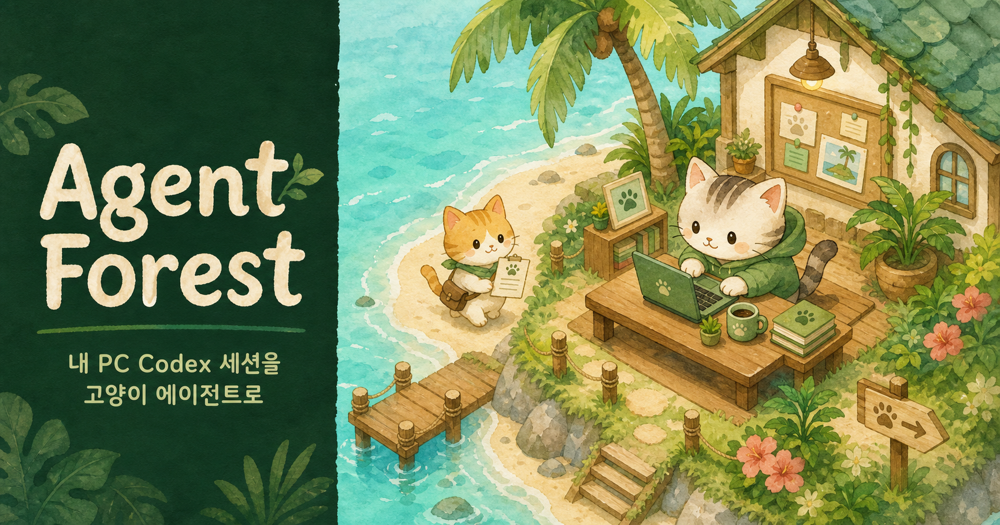
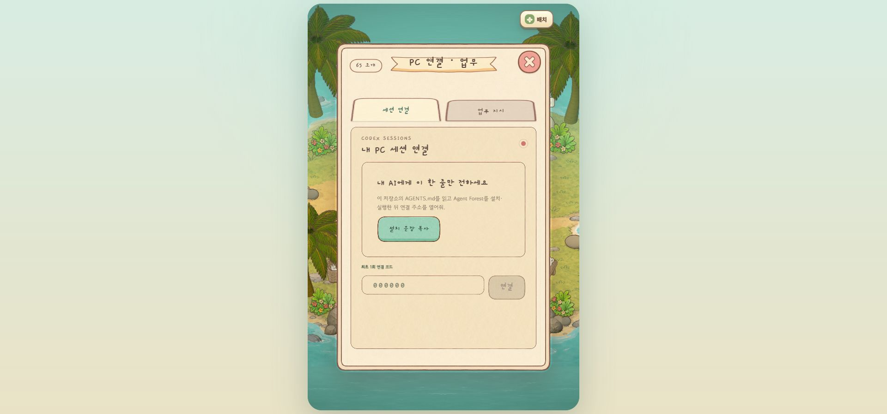
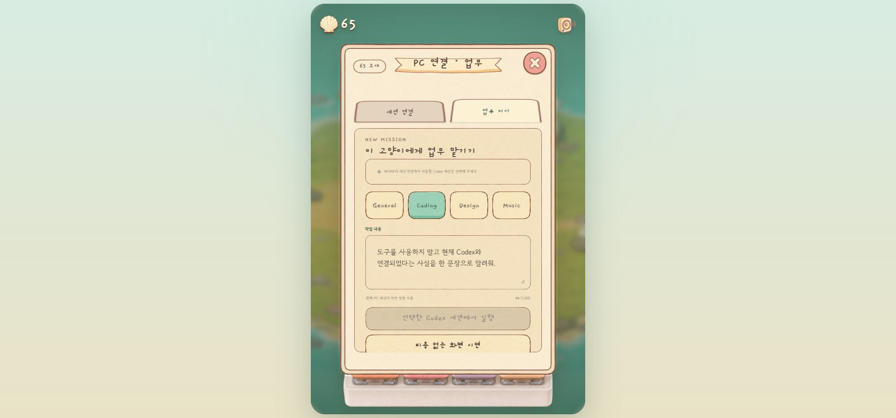
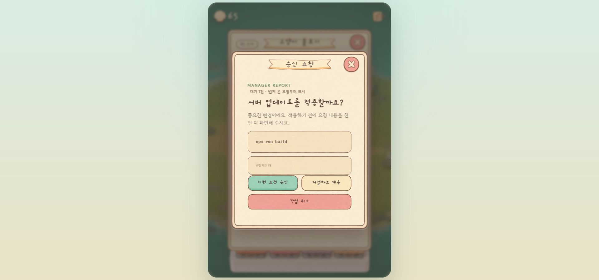
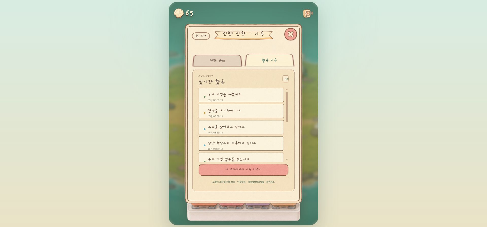

# Agent Forest

> 내 PC의 Codex·Claude Code 세션을 해변 사무실에서 일하는 고양이 에이전트로 보여 주는 브라우저 작업 공간

터미널 로그를 계속 읽지 않아도 어떤 세션이 업무를 분석하고, 코드를 살펴보고,
승인을 기다리거나 결과를 보고하는지 월드 안에서 확인할 수 있습니다. 고양이를
선택해 실제 AI 세션에 업무를 맡기고, 후속 지시·중단·승인 결정을 같은 화면에서
처리합니다.

- **공개 실행:** https://agent-forest-raccoon.sminia82.chatgpt.site/
- **운영 미러:** https://sidak.kr/autodev/GameCreator/catAgentGame/
- **개발자 정보:** https://agent-forest-raccoon.sminia82.chatgpt.site/developer/
- **이용·개인정보·라이선스:** https://agent-forest-raccoon.sminia82.chatgpt.site/legal/

<p align="center">
  <a href="https://agent-forest-raccoon.sminia82.chatgpt.site/">
    
  </a>
</p>

<p align="center"><b>이미지를 누르면 공개 화면을 바로 열 수 있습니다.</b></p>

## 어떤 프로젝트인가요?

Agent Forest는 **실제 AI 개발 세션을 연결하는 도구**와 **작업 상태를 읽기 쉬운
게임 월드로 바꾸는 인터페이스**를 한 화면에 담습니다.

PC Companion이 로컬의 Codex CLI/App Server와 Claude Code를 감지하고, 브라우저는
6자리 코드로 Companion과 페어링합니다. 연결 후에는 최근 세션을 고양이에게
지정하고 새 업무를 보내거나 기존 대화를 이어 갈 수 있습니다. 세션에서 발생한
이벤트는 업무 접수, 분석, 코딩, 승인 대기, 보고, 완료 같은 고양이 행동으로
변환됩니다.

게임 요소는 작업을 이해하기 쉽게 만들기 위한 표현 계층입니다. 실제 명령은
연결한 PC의 CLI 권한과 샌드박스 설정을 그대로 따르며, 중요한 승인 요청은 내용을
확인한 사용자가 직접 결정합니다.

## 지금 바로 둘러보기

| 실행 방식 | 주소 | 용도 |
|---|---|---|
| **Sites 공개 실행** | [Agent Forest 열기](https://agent-forest-raccoon.sminia82.chatgpt.site/) | 최신 공개 UI를 확인하는 기본 경로입니다. |
| **sidak 운영 미러** | [운영 미러 열기](https://sidak.kr/autodev/GameCreator/catAgentGame/) | 같은 프로젝트의 별도 운영 경로입니다. |
| **개발자 페이지** | [제작 방식 보기](https://agent-forest-raccoon.sminia82.chatgpt.site/developer/) | 기획 의도, 기술 구성과 다른 프로젝트를 소개합니다. |
| **무료 화면 시연** | 공개 실행 후 `PC 연결 · 업무` → `비용 없는 화면 시연` | Companion 없이 고양이의 업무 상태 전환을 먼저 확인합니다. |

공개 화면만 열어도 월드와 무료 시연을 볼 수 있습니다. 내 PC의 실제 파일과
세션을 다루려면 아래의 PC Companion을 함께 실행해야 합니다. 같은 PC에서는
로컬 연결을 우선 사용하고, 휴대폰이나 외부 네트워크에서는 암호화된 HTTPS 중계로
전환하므로 공유기 포트 포워딩은 필요하지 않습니다.

## 실제 화면

아래 이미지는 실제 브라우저 UI를 검증하며 저장한 QA 캡처입니다.

| PC Companion 연결 | 고양이에게 업무 맡기기 |
|---|---|
|  |  |

| 승인 요청 | 진행 상태와 활동 기록 |
|---|---|
|  |  |

## 실제 작업 흐름

1. **PC Companion 실행** — Codex CLI/App Server와 선택적으로 Claude Code를
   감지하고 로컬 브리지와 외부 중계를 준비합니다.
2. **6자리 코드 입력** — 브라우저와 Companion을 한 번 페어링합니다. 성공한
   브라우저는 연결 토큰을 보관하므로 평소에는 코드를 다시 입력하지 않습니다.
3. **세션과 고양이 연결** — 최근 저장 세션을 선택하거나 새 세션을 만들고 최대
   4개의 업무 자리에 담당 고양이를 배정합니다.
4. **업무 전송** — General, Coding, Design, Music 중 성격을 고르고 작업 내용을
   보냅니다. 연결한 세션의 기존 대화 맥락을 그대로 이어 갑니다.
5. **상태 확인** — 스트리밍 이벤트가 고양이의 이동, 착석, 타이핑, 승인 대기,
   보고 행동과 활동 기록으로 나타납니다.
6. **결정과 후속 지시** — Codex 승인 요청을 검토해 승인·거절하고, 진행 중인
   작업에 추가 지시를 보내거나 중단할 수 있습니다.
7. **완료 확인** — 결과를 고양이별 대화와 활동 기록에서 확인하고 다음 업무를
   이어서 맡깁니다.

## 핵심 기능

### 실제 AI 작업 연결

- Codex CLI와 App Server의 설치·로그인 상태 자동 감지
- Claude Code 로컬 세션 연결과 스트리밍 이벤트 표시
- 최근 저장 세션 목록, 새 세션 생성, 기존 세션 재개
- 고양이별 AI 세션 고정 및 최대 4개 세션 동시 시각화
- 새 업무, 후속 지시, 진행 중단과 Codex 승인 요청 처리
- 세션 제목·프로젝트·작업 상태를 민감 경로 없이 표시
- 브라우저 알림을 통한 승인 대기 안내
- 같은 PC의 로컬 HTTP+SSE 연결과 외부 네트워크의 HTTPS 중계 자동 선택

Claude Code 연결은 작업 전송과 상태 스트리밍을 지원하지만, Codex와 같은 승인
대화상자 흐름은 제공하지 않습니다.

### 해변 사무실 월드

- Next.js와 three.js로 구현한 설치 없는 2.5D 해변 사무실
- 업무 접수·분석·코딩·대기·승인·보고·완료 상태별 고양이 행동
- 낮·노을·밤 변화, 자율 이동, 책상 충돌 회피와 월드 사운드
- 고양이 이름·털색·성격·담당 세션을 각각 저장
- 조개 보상, 업무 자리와 스타일 해금, 브라우저 로컬 진행 저장
- 밥그릇, 화장실, 러닝휠과 배고픔·배변·행복도 돌보기
- PC와 모바일 화면 대응, 연결 없이 실행하는 무료 상태 시연
- 대화 전용 PM Worker AI와 Puter 연결, 로컬 AI 세션 선택 지원

## 로컬에서 실행하기

### 준비 사항

- Node.js **22.13.0 이상**
- 설치되고 로그인된 [Codex CLI](https://github.com/openai/codex)
- Claude Code 연결을 사용할 경우 설치·로그인된 Claude Code CLI

현재 저장소를 받은 폴더에서 다음 명령을 실행합니다.

```powershell
node --version
codex --version
codex login status
npm install
npm run dev:local
```

`npm run dev:local`은 웹 화면과 PC Companion을 함께 실행합니다.

- 웹 화면: `http://localhost:3000`
- PC Companion: `http://127.0.0.1:4317`
- 상태 확인: `http://127.0.0.1:4317/health`

터미널에는 다음 형태의 고정 6자리 연결 코드가 표시됩니다.

```text
[agent-companion] 연결 코드: 123456
```

브라우저에서 `PC 연결 · 업무` → `세션 연결`에 코드를 한 번 입력합니다. 연결
코드와 승인된 브라우저 토큰 해시는 로컬의 `.agent-forest-pairing.json`에
보존되며 Git에는 포함되지 않습니다.

웹 화면과 Companion을 별도 프로세스로 실행하려면 터미널 두 개에서 각각
실행합니다.

```powershell
npm run bridge
npm run dev
```

## 작업할 프로젝트 지정

새 세션의 기본 작업 폴더를 Agent Forest 소스가 아닌 다른 프로젝트로 지정하는
것을 권장합니다.

```powershell
$env:CODEX_BRIDGE_WORKSPACE = "D:\원하는\프로젝트"
npm run dev:local
```

환경변수는 실행한 프로세스에만 적용됩니다. 시스템 환경변수로 영구 등록하거나
작업 대상 프로젝트의 비밀값을 이 저장소에 복사할 필요가 없습니다.

## 연결 설정

| 환경변수 | 기본값 | 설명 |
|---|---|---|
| `CODEX_BRIDGE_WORKSPACE` | Agent Forest 저장소 루트 | 새 AI 세션의 기본 작업 폴더입니다. 실제 작업 프로젝트를 명시하는 것을 권장합니다. |
| `AGENT_BRIDGE_HOST` | `127.0.0.1` | 로컬 브리지 바인딩 주소입니다. 특별한 이유가 없다면 변경하지 마세요. |
| `AGENT_BRIDGE_PORT` | `4317` | PC Companion 포트입니다. |
| `AGENT_BRIDGE_PAIRING_CODE` | 로컬 파일의 6자리 코드 | 자동화된 테스트에서만 고정 코드를 주입할 때 사용합니다. |
| `AGENT_BRIDGE_ALLOWED_ORIGINS` | Sites 공개 Origin | 추가로 허용할 웹 Origin을 쉼표로 구분합니다. |
| `AGENT_FOREST_RELAY_URL` | Sites 공개 주소 | 외부 네트워크 중계 주소입니다. `off`로 설정하면 중계를 끕니다. |
| `NEXT_PUBLIC_AGENT_BRIDGE_URL` | `http://127.0.0.1:4317` | 브라우저가 먼저 시도할 로컬 Companion 주소입니다. |

추가 Origin을 허용하는 예시:

```powershell
$env:AGENT_BRIDGE_ALLOWED_ORIGINS = "https://example.com,https://another.example.com"
npm run bridge
```

## 보안과 데이터 처리

- Companion은 기본적으로 `127.0.0.1`에만 바인딩됩니다.
- 페어링 코드는 6자리이며 반복 실패에는 시간 창 기반 요청 제한이 적용됩니다.
- 승인된 토큰은 원문이 아니라 SHA-256 해시로 로컬 파일에 저장됩니다.
- 세션·업무 API는 Bearer 토큰을 요구하고, 브라우저 Origin은 허용 목록으로
  제한합니다.
- 외부 연결은 PC에서 시작하는 아웃바운드 HTTPS 중계를 사용합니다. 라우터 포트
  개방이나 공인 IP 노출이 필요하지 않습니다.
- 승인 요청은 자동으로 통과시키지 않습니다. 읽기 전용으로 명확히 분류된 일부
  명령을 제외하면 연결한 CLI의 승인·샌드박스 정책을 따릅니다.
- 브라우저는 연결 토큰, 선택 세션, 좌석, 꾸미기와 최근 활동을 localStorage에
  저장합니다. 무료 화면 시연은 외부 AI API 없이 브라우저에서 실행됩니다.
- `.env*`, `.dev.vars`, 페어링·Companion 파일과 로컬 로그는 `.gitignore`에
  포함됩니다.

연결 정보를 모두 초기화하려면 브라우저의 해당 사이트 데이터를 지우고
Companion을 종료한 뒤 `.agent-forest-pairing.json`을 삭제합니다. 자세한 정책은
[앱의 이용·개인정보 안내](https://agent-forest-raccoon.sminia82.chatgpt.site/legal/)에서
확인할 수 있습니다.

## 구조

```text
로컬 또는 공개 Agent Forest 웹 화면
        ↕ 로컬 HTTP + SSE
PC Companion (bridge/server.mjs)
        ↕ newline JSON-RPC / CLI adapter
Codex App Server 또는 Claude Code
        ↕
내 PC의 저장 세션, 실행 중인 작업과 승인 요청

외부 브라우저
        ↕ HTTPS
Cloudflare Worker + D1 중계
        ↕ PC가 시작한 아웃바운드 HTTPS 동기화
PC Companion
```

Cloudflare D1은 외부 페어링과 중계 상태를 다루고, 월드 진행과 꾸미기 상태는
브라우저에 남습니다. PC Companion이 꺼지면 공개 화면은 계속 열리지만 내 PC
세션을 새로 제어할 수는 없습니다.

## 기술 구성

| 영역 | 구성 |
|---|---|
| 웹 UI | Next.js 16, React 19, TypeScript, Tailwind CSS |
| 월드 렌더링 | three.js, GLB/FBX 모델, Canvas 이름표, 이중 외곽선 |
| 로컬 연동 | Node.js HTTP/SSE, Codex App Server JSON-RPC, Claude Code adapter |
| 클라우드 중계 | Cloudflare Workers, D1, Drizzle ORM |
| 빌드·로컬 런타임 | Vinext, Vite, Wrangler |
| 상태 저장 | 브라우저 localStorage, 로컬 페어링 파일, D1 중계 상태 |
| 검증 | Node test runner, ESLint, 렌더·프로토콜·경제·월드 회귀 테스트 |

## 프로젝트 구조

```text
catAgentGame/
├─ app/                     # 페이지, 2.5D 월드, 고양이·경제·대화 상태
│  ├─ page.tsx              # 메인 해변 사무실과 연결·업무 UI
│  ├─ agent-world-3d.tsx    # three.js 월드와 에이전트 렌더링
│  ├─ developer/            # 한·영 개발자 페이지
│  ├─ legal/                # 이용·개인정보·라이선스 안내
│  └─ play-record/          # 세로형 화면 녹화 도구
├─ bridge/                  # PC Companion, Codex/Claude adapter, 보안·중계
├─ worker/                  # Cloudflare API, 외부 릴레이와 플레이어 동기화
├─ db/                      # D1/Drizzle 스키마
├─ public/                  # 배포용 3D 모델, 이미지, UI·사운드 자산
├─ docs/                    # 기획, 화면 정의, QA 캡처와 제작 기록
├─ scripts/                 # 로컬 실행, 자산 처리와 배포 보조 도구
├─ tests/                   # 브리지·UI·월드·게임 경제 회귀 테스트
├─ LICENSE.md               # PolyForm Noncommercial 1.0.0
└─ THIRD-PARTY-NOTICES.md   # 패키지와 외부 자산 고지
```

## 처음 수정할 곳

| 파일 | 바꿀 수 있는 것 |
|---|---|
| `app/page.tsx` | 메인 UI, 세션 선택, 업무·승인 흐름과 월드 HUD |
| `app/agent-world-3d.tsx` | 고양이, 책상, 시설과 카메라의 3D 표현 |
| `app/companion-backends.ts` | Codex·Claude·대화형 백엔드의 표시와 기능 범위 |
| `app/cat-*.ts`, `app/*-economy.ts` | 고양이 성격·돌보기·조개·해금 규칙 |
| `bridge/server.mjs` | 페어링, 세션 API, SSE와 명령 라우팅 |
| `bridge/event-mapper.mjs` | Codex 이벤트를 고양이 행동으로 바꾸는 규칙 |
| `bridge/claude-event-mapper.mjs` | Claude Code 이벤트 상태 매핑 |
| `worker/relay.ts` | 외부 페어링·명령·이벤트 중계 |
| `public/` | 런타임 3D 모델, 이미지, UI와 사운드 자산 |

3D 객체를 교체하거나 새로 만들 때는
[에셋 교체 렌더링 표준](docs/asset-replacement-rendering-standard.md)의 팔레트,
리메시, Unlit 재질, 외곽선과 월드 캡처 검증을 함께 적용해야 합니다.

## 빌드와 검증

```powershell
# 정적 검사
npm run lint

# 기본 공개 빌드
npm run build

# 공개판과 서비스판을 명시적으로 빌드
npm run build:public
npm run build:service

# build 후 tests/*.test.mjs 전체 실행
npm test
```

실행 상태까지 확인할 때는 Companion과 개발 서버를 띄운 뒤 다음 요청이 모두
성공하는지 확인합니다.

```powershell
Invoke-RestMethod http://127.0.0.1:4317/health
Invoke-WebRequest -UseBasicParsing http://localhost:3000
```

테스트는 페어링·Origin 정책·토큰 저장, Codex/Claude 세션 연결, 외부 중계,
작업 상태 매핑, 렌더링 HTML, 고양이 행동·시설·경제와 낮/밤 월드 회귀를
다룹니다.

## 문서

- [다른 PC 설치 가이드](docs/agent-forest-other-pc-install-guide-20260804.html)
- [Codex 세션 연결 설계](docs/codex-session-connection-plan.html)
- [화면 정의서](docs/cat-agent-screen-definition-20260728.html)
- [메타·게임 설계](docs/cat-agent-meta-design-20260728.html)
- [에셋 교체 렌더링 표준](docs/asset-replacement-rendering-standard.md)
- [최근 실행·배포 인계](docs/handoff-seat4-and-chat-20260806.html)

## 라이선스와 기여

Agent Forest 자체 코드는 [PolyForm Noncommercial 1.0.0](LICENSE.md) 조건으로
제공됩니다. 개인 연구·실험·학습·취미와 비영리 목적의 사용은 허용되지만,
상업적 이용과 재판매에는 별도 허락이 필요합니다.

React, Next.js, three.js 등 패키지와 3D 캐릭터·애니메이션·생성 자산은 각자의
원래 라이선스 또는 생성 조건을 따릅니다. 자세한 내용은
[THIRD-PARTY-NOTICES.md](THIRD-PARTY-NOTICES.md)를 확인하세요. 이 프로젝트는
OpenAI 또는 Anthropic의 공식 제품이 아닙니다.

변경을 제안할 때는 작업 대상의 기존 설계 문서와 테스트를 먼저 확인하고,
비밀값·페어링 파일·서버 자격 증명·고해상도 생성 원본을 커밋하지 마세요.

<details>
  <summary><b>English summary</b></summary>
  <br>
  <p><b>Agent Forest</b> is a browser workspace that turns local Codex and Claude Code sessions into cats working in a seaside office. Pair the page with the PC Companion using a six-digit code, assign saved AI sessions to up to four cats, send or continue work, review Codex approval requests, cancel active work, and follow live progress through character movement and activity logs.</p>
  <ul>
    <li><a href="https://agent-forest-raccoon.sminia82.chatgpt.site/">Open the hosted Agent Forest UI</a></li>
    <li>Local HTTP/SSE on the same PC and an outbound HTTPS relay for phones or remote browsers</li>
    <li>Next.js, React, three.js, Cloudflare Workers, D1 and a Node.js PC Companion</li>
    <li>Session pairing, token hashing, Origin allowlisting and user-controlled approvals</li>
    <li>A browser-local game layer with cat customization, care facilities and day/night changes</li>
    <li>Source code under PolyForm Noncommercial 1.0.0; third-party assets retain their own terms</li>
  </ul>
  <p>The hosted page can be explored without a Companion, but controlling files and AI sessions on your PC requires the local bridge to be running.</p>
</details>

---

Made with vibe coding by [Water Castle Games](https://www.threads.com/@watercastlegames?hl=ko) · [Open Agent Forest](https://agent-forest-raccoon.sminia82.chatgpt.site/) · [Developer page](https://agent-forest-raccoon.sminia82.chatgpt.site/developer/)
